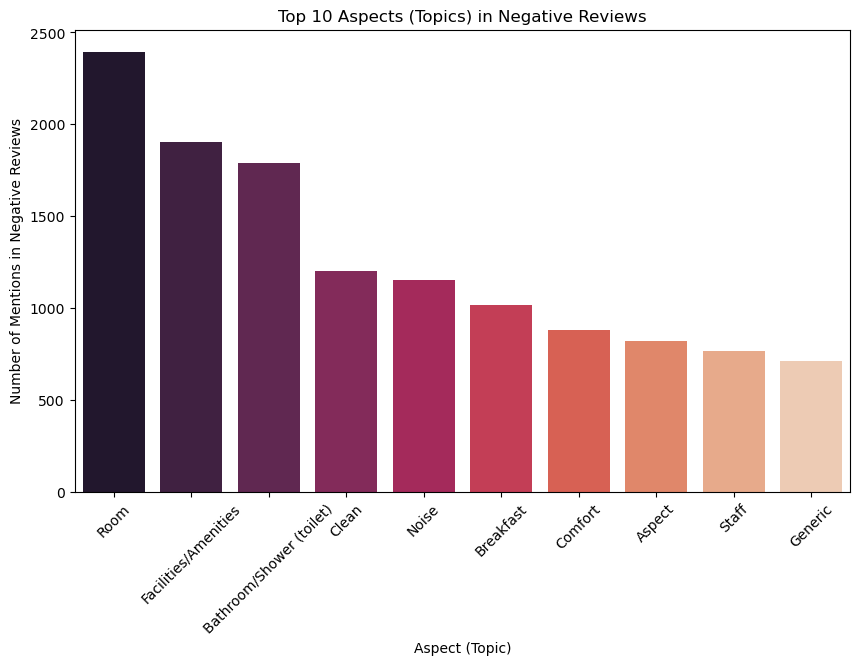
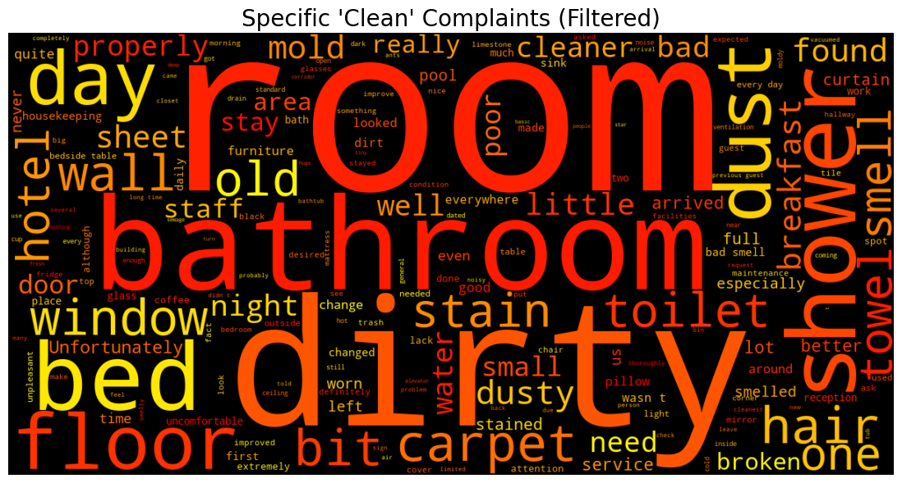
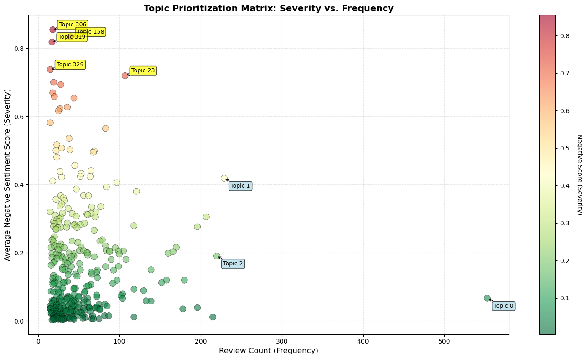

# Hotel Guest Experience Analysis

### 1. Project Motivation: The Supervisor's Perspective
This project bridges my professional worlds as a Data Analyst and part-time Hospitality Supervisor. Having recently graduated with a Master's in Analytics, I'm captivated by the power of Natural Language Processing (NLP). However, as a former part-time **Housekeeping Supervisor**, I understand the operational reality behind the data. I know that a "cleanliness" complaint isn't just a data point. It's a specific failure in a process, whether it's a missed stain or a dusty vent.

I built this project to answer a critical question that every hotel manager faces: **"We have thousands of reviews. What do we fix *first*?"**

My goal was to move beyond simple word counting and build a deep-learning pipeline that distinguishes between *frequent annoyances* and *severe brand risks*.

### 2. The Methodology & Findings
My analysis was a three-phase process, moving from a high-level overview to a specific, actionable insight.

#### Phase 1: What are the most common problems?
Using the dataset from Kaggle, I first used the pre-labeled data to find the most frequent complaints. The results were intuitive and aligned with my experience on the floor. Guests talk most about **Staffs**, **Facilities**, and **Bathrooms**.

#### Phase 2: What are the *specifics* of the complaints?
This high-level view was useful, but not actionable. To drill down, I created a filtered word cloud for reviews that were *both* `negative` and `Clean`. By removing generic words, I uncovered the specific operational issues: **"stains," "hair," "smell,"** and **"floor"** which could be taken directly to a room attendant training session.

#### Phase 3: What should we prioritize? (Frequency vs. Severity)
Finally, I built a full NLP pipeline from scratch to answer the key strategic question.
1.  **Sentiment Model:** I used a `RoBERTa` Transformer model to assign a precise severity score to every review.
2.  **Topic Model:** I used `BERTopic` to automatically find 300+ specific topics. (To ensure my analysis was rigorous and reproducible, I stabilized the `BERTopic` results by explicitly defining the `UMAP` and `HDBSCAN` component models with fixed `random_state` seeds).

I then plotted every topic on a **Topic Prioritization Plot**. This was the key insight of the entire project.

This plot clearly proves that:
**What guests talk about *most* is NOT what makes them the *angriest*.**

* **Bottom Right (The "Annoyances"):** Topics like "slippery showers" and "wifi" are frequent but have low negative sentiment.
* **Top Left (The "Brand Killers"):** The topic for "rude, unprofessional staff" is rare, but it is *by far* the most negative.

### 3. Conclusion: An Actionable Strategy
This project successfully created a "Prioritization Dashboard." It allows management to move past "gut feel" and distinguish between:
1.  **Chronic Annoyances** (fix with process, e.g., shower mats)
2.  **Acute Emergencies** (fix with urgent training, e.g., staff behavior)

This data-driven approach is the key to allocating resources effectively and protecting the brand.

### 4. Technical Stack
* **Language:** Python 3.10
* **NLP Core:** `transformers` (Hugging Face), `bertopic`, `nltk`
* **Modeling:** `umap-learn`, `hdbscan` (for stable clustering)
* **Data Manipulation:** `pandas`, `numpy`
* **Visualization:** `matplotlib`, `seaborn`, `wordcloud`

---
*This project was built using VSCode and Jupyter Notebooks.*