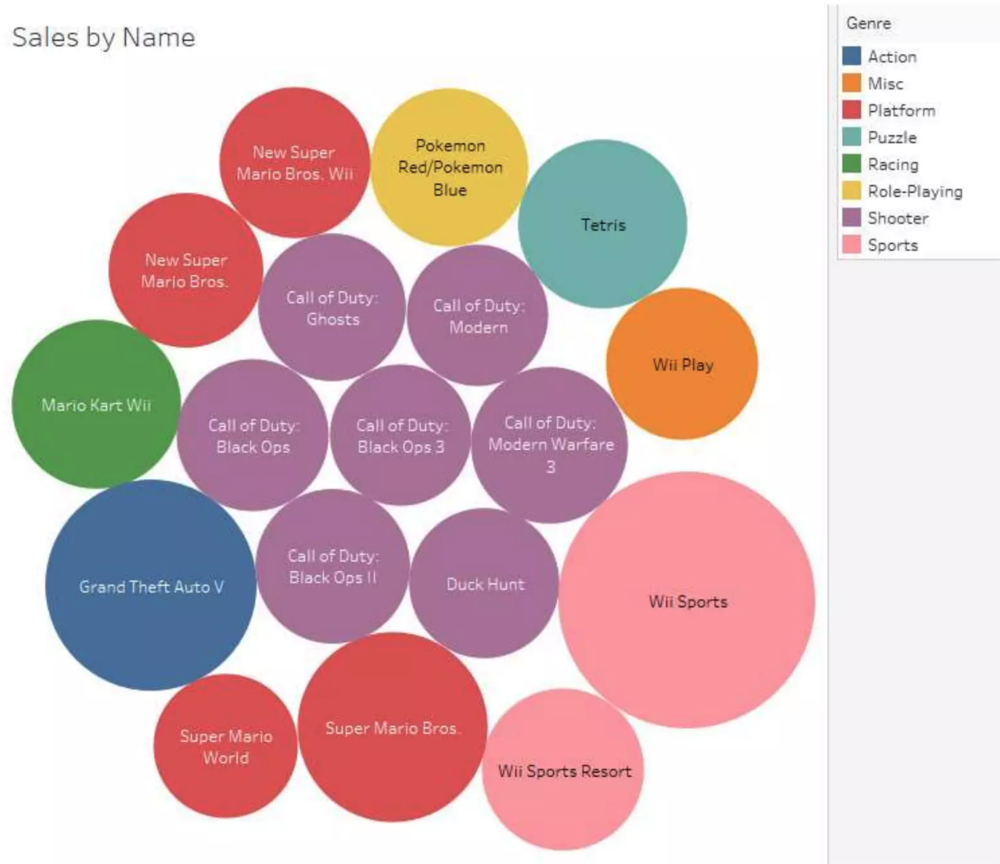
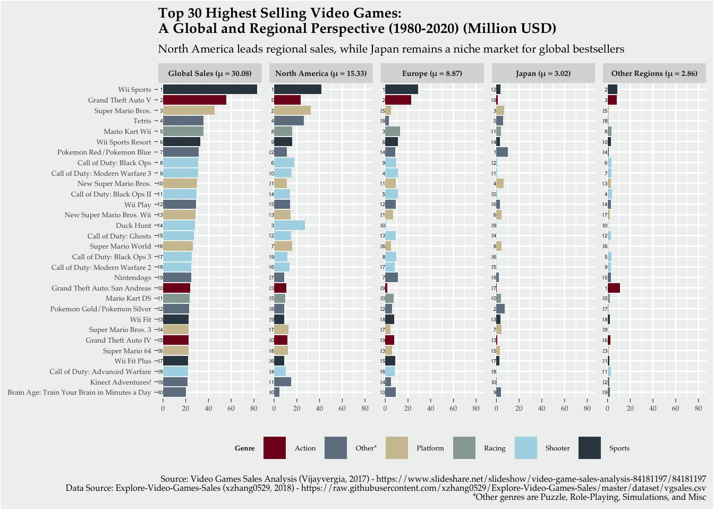

# Video Game Sales Revisualization: Deconstruct & Reconstruct

This project analyzes and improves a visualization of the "Top 30 Highest Selling Video Games (1980-2020)". The goal was to transform a problematic bubble chart into a faceted bar chart that provides clearer regional insights and more accurate comparisons.

## 1. Deconstruct: The Original Visualization

### Objective
The original visualization aimed to provide a broad summary of video game sales by name. It used bubble sizes to show sales volume and colors to indicate genres, helping viewers quickly see top-selling games and compare them across genres.

### Target Audience
The primary audience included **video game analysts**, **developers**, and **business stakeholders** who would likely encounter this visualization in a **Market Intelligence Annual Report** or a **Gaming Industry Newsletter**. They use the visualization to identify popular genres and top-performing products to aid in strategic decision-making.

### Key Critiques
The original bubble chart had three significant issues:
1.  **Lack of Clear Ranking:** Human visual perception is less precise at judging size (area) than length or position, making it difficult to rank games accurately.
2.  **No Regional Breakdown:** The chart only showed global sales, missing critical performance differences in major markets.
3.  **Genre Clutter:** Using too many distinct colors for individual genres overwhelmed the legend and reduced accessibility.

## 2. Reconstruct: The Improved Visualization

The reconstruction was built using **R and ggplot2** to address the identified issues directly.

### Improvements Made:
- **Bar Charts for Accuracy:** Switched to bar lengths for easier and more accurate comparisons and ranking.
- **Faceted Regional Analysis:** Broke down sales into five facets: **Global Sales**, **North America**, **Europe**, **Japan**, and **Other Regions**.
- **Standardized Scales:** All regional facets share the same x-axis scale, allowing for an honest comparison of magnitude across different markets.
- **Simplified Genres:** Regrouped minor genres into an **"Other*"** category to reduce visual noise.
- **Improved Header Information:** Integrated statistical mean values ($\mu$) directly into the facet headers, keeping the data area clean and clutter-free.
- **Colorblind-Friendly Design:** Employed a professional, high-contrast color palette and legible typography.

## Project Structure

- `Revisualization_code.Rmd`: R Markdown source code for data processing and visualization.
- `Original_Viz_GameSales_by_Name.png`: The original bubble chart being critiqued.
- `Improved_Viz.png`: The final reconstructed visualization.
- `Revisualization_code.html`: The knitted web report output.

## How to Run
This project requires **R** and the following libraries:
- `ggplot2`, `tidyr`, `dplyr`, `tidyverse`, `extrafont`

The dataset is automatically fetched from the source repository during execution.

---
*Developed as part of the MATH2270 Data Visualisation & Communication course at RMIT University.*
